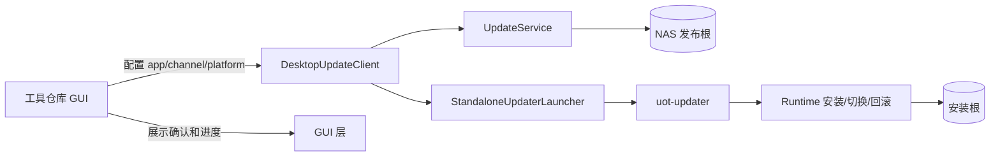
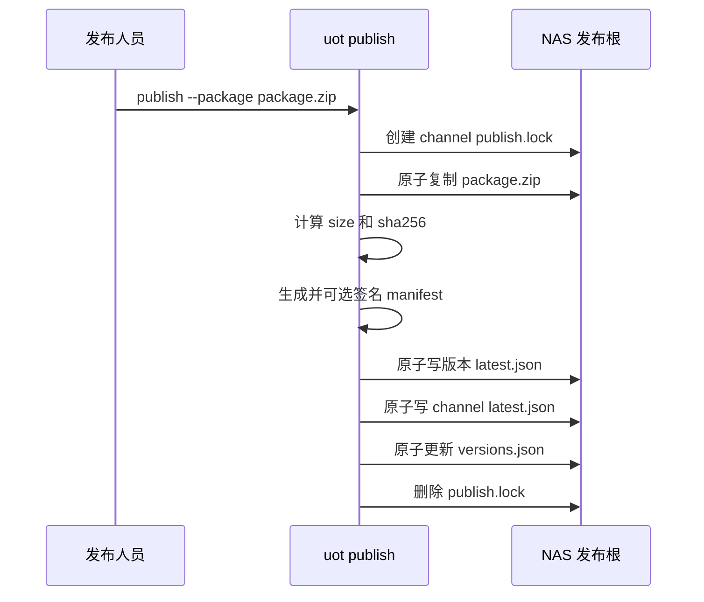
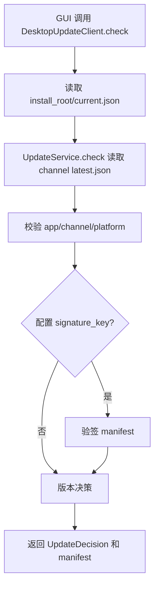
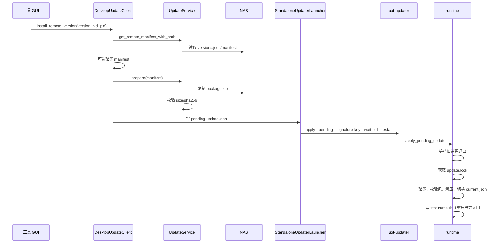
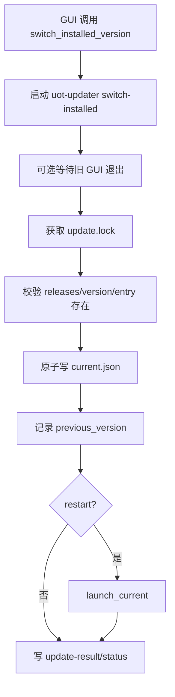
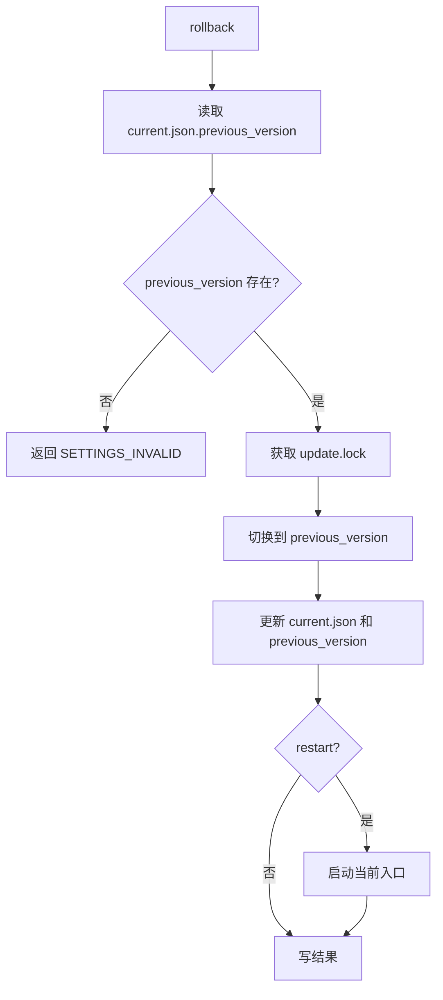

# UpdateOnlineTool Technical Architecture

本文档说明 UpdateOnlineTool（UOT）的技术原理、架构边界、核心数据契约和完整执行链路。UOT 当前是单机 CLI 发布 + NAS 文件发布根 + 桌面客户端 runtime 的在线更新工具，不是服务端发布平台。

## 设计目标

UOT 的目标是把桌面应用在线更新能力从具体工具仓库中抽离出来。工具仓库只负责配置、GUI 展示和调用 UOT facade；UOT 负责 NAS 发布、版本发现、包校验、下载、安装、切换、回滚、状态记录和标准 updater 进程。

设计原则：

- 文件发布优先：NAS 是发布根，`latest.json`、`versions.json` 和 `package.zip` 是核心交付物。
- 客户端自治：客户端不依赖服务端 API，直接读取 NAS 文件。
- 运行态集中：安装根下的 `current.json`、`update.lock`、`update-status.json` 和 `update-result.json` 由 UOT 维护。
- 工具仓库轻量：工具仓库不得拼 updater 命令、解析 `current.json`、构造版本 manifest 路径或处理 exe/sidecar。
- 失败可恢复：安装、sidecar 提升、同版本覆盖和状态写入尽量通过锁、临时目录、备份和原子替换降低半更新风险。

## 系统边界



工具仓库拥有：

- 用户确认、弹窗、进度条、线程调度。
- `app_id`、`platform`、`channel`、`install_root`、settings 路径。
- 对 `DesktopUpdateClient` 返回值的展示。

UOT 拥有：

- settings/NAS 解析、manifest 模型、版本决策、签名验签。
- 发布、校验、历史版本索引、包复制与 SHA-256 校验。
- PyInstaller 安装目录和升级目录装配。
- pending 写入、updater 解析与启动。
- 打包 updater 预热和冷启动诊断入口。
- release 安装、本地版本切换、回滚、旧进程等待、重启、状态和诊断。

## 模块职责

| 模块 | 职责 |
| --- | --- |
| `settings.py` | 解析 `config/settings.json`、用户级 settings、`nas.root` 和 `nas.roots`，规范化 UNC 和 `file://` 路径。 |
| `nas.py` | 生成 NAS 上 `latest.json`、`versions.json`、版本目录和包路径；拒绝 manifest 中的 UNC、盘符、反斜杠和绝对路径。 |
| `manifest.py` | 定义 manifest schema、包信息、策略字段和签名字段。 |
| `signature.py` | 生成 HMAC/Ed25519 密钥，签名和验签 manifest。 |
| `service.py` | 低层 SDK，负责检查更新、列出远端版本、读取指定版本 manifest、准备包。 |
| `desktop.py` | 面向桌面 GUI 的高层 facade，统一检查、列表、安装、切换、回滚、updater 预热和状态读取。 |
| `launcher.py` | 写入 `pending-update.json` 并启动标准 updater。 |
| `runtime.py` | updater 运行态，负责安装、切换、回滚、锁、状态文件、旧进程等待和重启。 |
| `installed.py` | 管理安装根 `releases/<version>` 和 `current.json`。 |
| `pyinstaller_assembly.py` | 生成标准安装根、升级目录和 updater sidecar。 |
| `cli.py` | 发布端和运维端 CLI。 |
| `updater_cli.py` | 打包进应用的窄 updater CLI，只保留安装、apply、切换、回滚和启动当前版本。 |

## 数据契约

### NAS 发布根

```text
<nas_root>/
└── <app_id>/
    └── <channel>/
        ├── latest.json
        ├── versions.json
        ├── <platform>/
        │   ├── latest.json
        │   └── versions.json
        └── v<version>/
            └── <platform-or-empty>/
                ├── latest.json
                └── package.zip
```

`latest.json` 用于普通检查更新。`versions.json` 用于历史版本列表和自由选择版本。`versions.json.manifest_url` 是指定历史版本 manifest 的权威路径，GUI 和工具仓库不得自己拼 `<app>/<channel>/v<version>/latest.json`。

### Manifest

manifest 采用 schema version 2，核心字段包括：

- `app_id`、`channel`、`version`、`platform`
- `mandatory`、`min_supported_version`
- `notes`
- `package.url`、`package.size`、`package.sha256`
- `allow_downgrade`、`hidden`、`requires_confirmation`、`rollout_percent`、`data_schema_version`
- `signature`

`package.url` 必须是 NAS 根目录下的 forward-slash 相对路径。UNC、盘符、`file://`、绝对路径、`..` 和反斜杠都不允许进入 manifest。

### 安装根

```text
<install_root>/
├── <stable-entry.exe>
├── current.json
├── updater/
├── releases/
│   ├── 1.0.0/
│   └── 1.1.0/
├── pending-update.json
├── update.lock
├── update-status.json
└── update-result.json
```

`current.json` 指向当前激活 release，并记录 `previous_version` 供回滚。`update.lock` 防止安装、切换和回滚并发执行。`update-status.json` 和 `update-result.json` 使用同目录临时文件原子替换，方便 GUI 轮询。

## 发布流程

UOT 发布是单机 CLI 模型。发布人员在发布机运行 `uot publish`，直接写 NAS 发布根；不需要部署发布服务。



`publish.lock` 只用于避免重复发布命令互相覆盖。若发布进程异常退出后留下锁，确认没有正在运行的 `uot publish` 后可人工删除。

## 检查更新和历史版本



历史版本列表使用 `DesktopUpdateClient.list_remote_versions()`，优先读取 `versions.json`，并补充扫描通道版本目录和 legacy 全局版本目录。配置签名公钥时，列表中的 manifest 也会在展示前验签。

## 远端指定版本安装



安装包中的 `_launcher/` 和 `updater/` sidecar 会被提升到安装根。若 current 切换前失败，UOT 会回滚 sidecar 和被 `--force` 覆盖的 release，避免安装根指向损坏目录。

## 本地版本切换

本地版本切换不访问 NAS，也不下载包。它只切换已经存在于安装根 `releases/<version>` 的版本。



工具仓库不应直接改 `current.json`。所有本地切换都应通过 `DesktopUpdateClient.switch_installed_version()` 或打包后的 `uot-updater switch-installed`。

## updater 预热和冷启动诊断

打包后的 PyInstaller updater 在 macOS 等平台上可能出现新路径首次执行慢、第二次执行很快的冷启动现象。这类耗时发生在 updater 进程首次加载阶段，不等同于 `current.json` 切换慢，也不能仅凭签名、quarantine、NAS 路径或包大小直接归因。

UOT 在桌面 facade 中提供 `DesktopUpdateClient.prewarm_updater()` 作为标准预热入口。GUI 可以在启动后空闲阶段从后台线程调用该方法，让首次加载成本提前发生；后续用户触发 `install_remote_version()`、`switch_installed_version()` 或 `rollback()` 时仍走同一套标准 updater runtime。

预热的约束：

- 预热只运行 updater 的轻量帮助命令，不修改安装根状态。
- 预热失败是非阻塞优化失败，不应阻止检查更新、安装、切换、回滚或业务处理。
- 工具仓库不得为了预热自行解析 `updater/` 目录或拼 updater 命令，应通过 `DesktopUpdateClient` 调用。
- 排查性能时应从 fresh copied install root 分别记录首次/第二次 `--help` 和 `switch-installed` 耗时，再判断是 updater 冷启动、运行态切换、签名/公证还是其他因素。

## 回滚流程



回滚依赖 previous release 仍在安装根中。未来如果增加 release 清理策略，必须保留 current 和 previous，或在清理前更新可恢复策略。

## 失败处理

| 场景 | 处理方式 |
| --- | --- |
| NAS 不可访问 | 返回 `NAS_SOURCE_UNAVAILABLE`，GUI 展示错误或静默跳过更新。 |
| manifest 被篡改 | `--signature-key` 或 `DesktopUpdateConfig.signature_key` 会触发验签失败。 |
| 包大小/hash 不匹配 | 复制或安装前失败，不切换 `current.json`。 |
| ZIP 路径穿越 | runtime 拒绝解压。 |
| 旧进程未退出 | 返回 `PROCESS_TIMEOUT`，提示用户关闭应用后重试。 |
| 并发安装/切换 | `update.lock` 返回 `UPDATE_LOCKED`。 |
| sidecar 提升后切换失败 | 回滚旧 launcher/updater。 |
| `--force` 覆盖同版本后切换失败 | 恢复旧 release。 |
| GUI 退出后无法接收回调 | 通过 `update-status.json` 和 `update-result.json` 观察。 |

## SDK 和 CLI 使用边界

新 GUI 集成首选：

```python
client = DesktopUpdateClient.from_config(
    DesktopUpdateConfig(
        app_id="my-tool",
        install_root=Path(r"D:\Tools\MyTool"),
        settings_path=Path("config/settings.json"),
        platform="windows",
        signature_key=Path("config/uot-signing.pub"),
    )
)
result = client.check()
versions = client.list_remote_versions()
client.install_remote_version(result.manifest.version, old_pid=12345, restart=True)
```

发布和运维使用 `uot`。最终应用内 updater 使用 `uot-updater`，不需要携带完整发布端 CLI。

## 打包边界

应打包：

- 安装根稳定入口。
- `releases/<initial_version>/`。
- 初始 `current.json`。
- 标准 `updater/` sidecar。
- GUI 运行时需要的 `update-endpoint.json`。

不应打包为源码配置：

- NAS 上的 `latest.json`、`versions.json`。
- 运行态 `pending-update.json`、`update-status.json`、`update-result.json`、`update.lock`、logs。
- 签名私钥或 NAS 凭证。

## 当前限制

- `rollout_percent` 仍是 manifest 元数据，尚未执行确定性灰度命中。
- 没有内置 updater 可视化窗口；实时进度由状态文件或外部监控进程读取。
- 没有自动 release 清理策略。
- same-version cross-channel 本地仍共用 `releases/<version>`，需要递增版本号或显式 `--force`。
- 客户端 stale `update.lock` 需要人工或后续显式清理命令处理。

## 关联文档

- [integration-guide.md](integration-guide.md)：工具项目接入和命令示例。
- [enterprise-update-architecture.md](enterprise-update-architecture.md)：企业级差距和风险评审。
- [pyqt-integration.md](pyqt-integration.md)：PyQt 集成细节。
