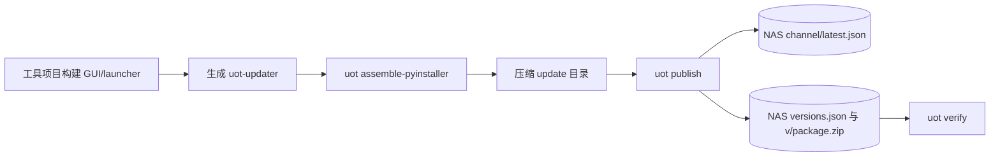
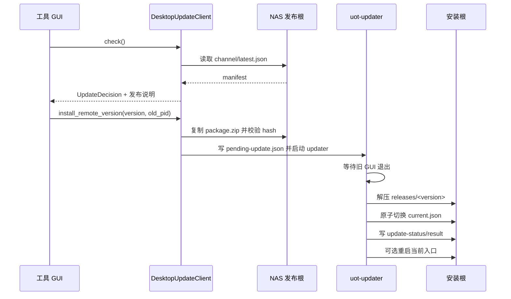

# UOT 用户与工具接入指南

本文是 UpdateOnlineTool（UOT）的端到端入口，区分最终用户和接入方开发者的职责。UOT 使用 NAS 文件发布根，不需要部署 HTTP 服务；NAS 用户名和密码由操作系统的 SMB 凭据管理。

## 1. 最终用户会看到什么

用户只需要启动应用并使用应用自己的“检查更新”或“更新”按钮：

1. 应用读取当前版本并检查默认 channel 的 `latest.json`。
2. 应用展示版本号、发布说明、强制更新或确认提示。
3. 用户确认后，应用从 NAS 复制升级包并校验大小和 SHA-256。
4. 新接入由 Update Agent 等待旧 GUI 退出，安装到 `releases/<version>`，切换 `current.json` 后由稳定 Bootstrap 重启应用；既有 PyInstaller sidecar 兼容路径仍由 `uot-updater` 完成相同事务。
5. 新版本可以读取 `update-status.json` 和 `update-result.json` 展示结果。

用户不需要执行 `pip install`、修改 `current.json` 或手动解压升级包。

## 2. 接入方的最小步骤

### 2.1 安装并生成配置

在工具项目根目录执行：

```bash
python -m pip install -e .
uot init \
  --app my-tool \
  --nas-root /Volumes/release-share/UpdateOnlineTool \
  --settings-output config/settings.json
```

提交 `update-endpoint.json` 和脱敏后的 `config/settings.json`。不要在 settings 中保存 NAS 密码、API token 或私钥。Windows 可以把 `--nas-root` 换成 UNC 路径，例如 `\\nas-server\release-share`。

### 2.2 PyInstaller legacy：构建并装配应用

以下流程仅适用于保留 `uot-updater` sidecar 的既有 PyInstaller 工具。新建
Electron/Tauri 接入应跳至 [2.4](#24-electron--tauri-宿主)。PyInstaller 是接入方的构建依赖，不会作为 UOT 的运行时依赖自动安装：

```bash
uot write-updater-spec --output-dir build/updater --name MyToolUpdater
python -m PyInstaller --noconfirm build/updater/MyToolUpdater.spec
```

将 GUI、launcher 和 updater 交给 UOT 装配：

```bash
uot assemble-pyinstaller \
  --version 1.0.0 \
  --product-name MyTool \
  --app my-tool \
  --settings config/settings.json \
  --updater-bundle dist/MyToolUpdater \
  --force
```

装配后的安装包以稳定入口作为用户快捷方式；实际版本位于 `releases/1.0.0/`。将 `dist/MyTool_update_v1.0.0/` 的内容压缩为升级包，不能把该目录本身再套一层目录，否则 updater 找不到入口文件：

```bash
python -m zipfile -c dist/MyTool_1.0.0.zip dist/MyTool_update_v1.0.0/*
```

升级包应包含 `updater/` sidecar，但不应预置 `latest.json`、`pending-update.json` 或运行态日志。

### 2.3 PyInstaller legacy：在 GUI 中调用 SDK

GUI 负责按钮、弹窗、线程和进度，UOT 负责 NAS、manifest、安装、切换和回滚。耗时调用应放在 UI 线程之外：

```python
import os
from pathlib import Path

from update_online_tool import DesktopUpdateClient, DesktopUpdateConfig, UpdateDecision

client = DesktopUpdateClient.from_config(
    DesktopUpdateConfig(
        app_id="my-tool",
        install_root=Path("/opt/MyTool"),
        settings_path=Path("config/settings.json"),
        platform="linux",
    )
)
result = client.check()
if result.decision is not UpdateDecision.NO_UPDATE and result.manifest:
    client.install_remote_version(result.manifest.version, old_pid=os.getpid(), restart=True)
```

用户选择历史版本时使用 `list_remote_versions()`；切换已经安装的版本使用 `switch_installed_version()`；回滚使用 `rollback()`。工具项目不要自行拼 manifest 路径或修改 `current.json`。

### 2.4 Electron / Tauri 宿主

Electron 和 Tauri 不直接实现 NAS 更新协议。它们将 `app_id`、安装根、settings、平台和 channel 写入 bridge 配置，并由 Electron Main Process 或受控 Rust command 调用 `uot-bridge`：先 `check`，用户确认后 `prepare`，再用 `agent-start` 等待 Agent ready；宿主保存工作后调用 `agent-handoff` 并退出。Agent 等待旧 PID、完成安装和切换，稳定 Bootstrap 再启动 active release。Renderer/WebView 只能通过宿主 IPC 接收结果；它们不得修改 `current.json` 或直接启动 release。

新 Electron/Tauri release 还应携带 `uot-release.json`，并在 bridge 中配置
`release_required_paths`（例如 settings 与 onedir bridge）。这让 UOT 在安装、
本地版本选择和回滚时共同拒绝不完整 release，而不是依赖 GUI 过滤。

## 3. PyInstaller legacy 发布端工作流



发布人员在发布机执行 `uot publish`，直接写入 NAS；不需要部署发布服务。多平台发布时显式增加 `--platform windows|macos|linux`，避免同版本包互相覆盖。企业环境可用 `uot keygen` 生成签名密钥，并只把公钥放进客户端。

实际发布命令示例：

```bash
uot publish \
  --settings config/settings.json \
  --app my-tool \
  --version 1.0.0 \
  --platform linux \
  --package dist/MyTool_1.0.0.zip

uot verify \
  --settings config/settings.json \
  --app my-tool \
  --platform linux
```

## 4. PyInstaller legacy 客户端更新工作流



## 5. 文件归属速查

| 文件 | 所在位置 | 谁负责 | 是否进入应用包 |
| --- | --- | --- | --- |
| `update-endpoint.json` | 工具项目 | 接入方 | 按 GUI 运行时需要分发 |
| `config/settings.json` | 项目或用户配置目录 | 接入方/UOT | 由装配命令复制到运行时位置 |
| `latest.json`、`versions.json` | NAS channel 目录 | `uot publish` | 否 |
| `current.json` | 安装根 | UOT runtime | 初始安装根需要，后续由 updater 修改 |
| `pending-update.json` | 安装根 | SDK/updater | 否，运行时生成 |
| `update-status.json`、`update-result.json` | 安装根 | UOT runtime | 否，运行时生成 |

## 6. 出问题时怎么查

先运行 `uot verify --settings config/settings.json --app my-tool`，确认 NAS manifest、包大小和 SHA-256；安装失败时运行 `uot doctor --install-root <install-root> --archive diagnostics/doctor.zip`。Bootstrap/Agent 模式下，优先查看报告中的 `agent_operations.latest.phase`、`message` 和 `error`，并在支持包中关联 `operations/<operation-id>.request/status/handoff.json`（request 在支持包中会脱敏）；request 不得放入凭据或私钥。如果 NAS 不可访问，先检查操作系统 SMB 凭据和 `uot init --nas-root <path>` 的读写探测结果。

更完整的模块职责和数据契约见 [technical-architecture.md](technical-architecture.md)，PyQt worker 和 pending manifest 细节见 [pyqt-integration.md](pyqt-integration.md)。
